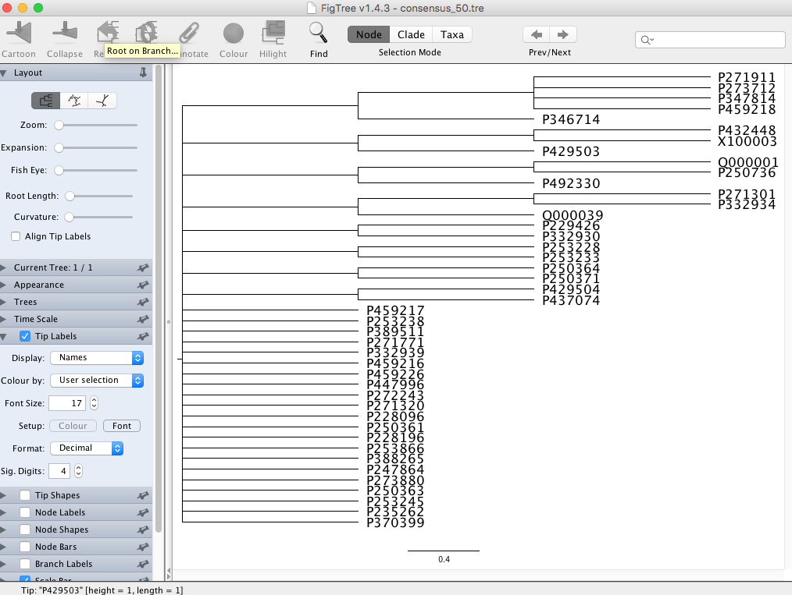
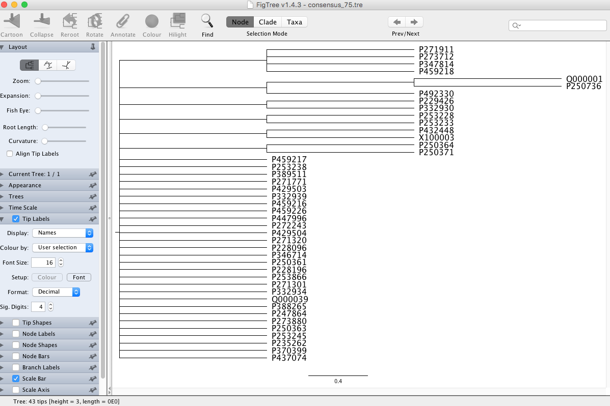

# Comments on the Dendrograms: Similarity on Inclusion/Exclusion of Items

The dendrograms are made by analyzing textual overlap between documents. "Overlap" in this cased, exclusively means overlap in the presence of lemmatized entries (disregarding order). The similarity measure used is the number of shared entries divided by the length of the shortest text. This similarity measure is always between 0 and 1. A brief text that shares all its lines with a long text will have a similarity **1**, even if these shared lines are not found together in the longer text. Two long text that essentailly may have had the same entires, but are both only partially preserved (and have limited overlap) will have low similarity, because the number of shared entries is low compared to the length of the shortest text.

The dendrogram was bootstrapped with 1,000 iterations and the resulting trees represent 50% and 75% consensus. 

Both trees create a group of four text, [P271911, P273712, P347814, and P459218](http://oracc.org/dcclt/P271911,P273712,P347814,P459218). A review of these texts show that they come from different places and times (Old Babylonian Isin, Middle Babylonian Emar, two unprovenanced Old Babylonian texts), but have one thing in common: they correspond to the second half of the Nippur list of trees and wooden objects.

The Nippur list of trees and wooden objects is one long list (some 750 entries). At several other sites this list was broken into two parts, one list that covers trees, furniture, and wagons, and another one that covers doors, agricultural tools, and miscellaneous objects. The four texts correspond in that they have entries for scales, hoes, brick molds, etc. - they do not seem to have much else in common.

The 50% tree adds the text [P346714](http://oracc.org/dcclt/P346714) which is a text from OB Ur. This text originally most probably had the entire list (trees, furniture, wagons, doors, agricultural tools, and varia), but the obverse is entirely broken. It shares a good number of entries with the shortest of the group discussed above [P273712](http://oracc.org/dcclt/P273712), and puts those (mostly) in the same order. For those reasons I argued that [P273712](http://oracc.org/dcclt/P273712) is related to the Ur tradition as represented by [P346714](http://oracc.org/dcclt/P346714). Other texts that I put in the same group are 
